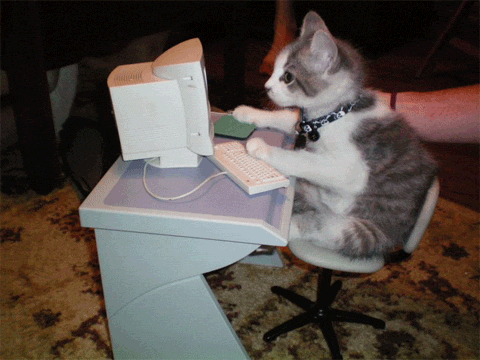

# Hello

about me | cool cat
:----:|:-------:
I'm a software developer with proficiency in Java and Golang. I have a keen interest in backend development and system design, and I love building scalable, reliable, and efficient systems. I enjoy working on projects that involve designing and developing APIs, microservices, and distributed systems. | 

# What I'm Currently Working On

I am currently working on developing a REST API that is designed to solve the Funcaptcha audio challenges using signal analysis & machine learning. The API takes the challenge as input and uses signal analysis and machine learning algorithms to accurately determine the answer before returning it to the user.